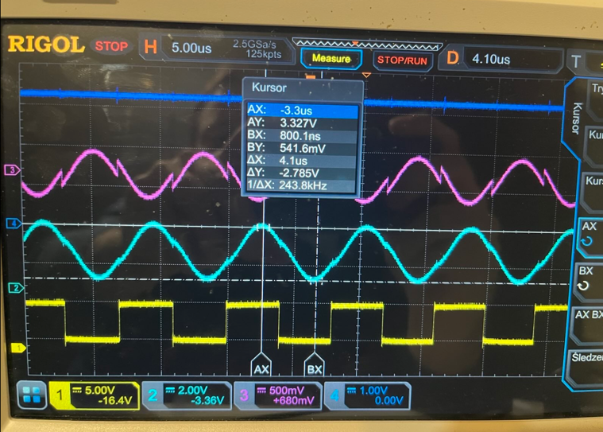

# RP2350/RP2040 HITAG/RFID API

**USE AT YOUR OWN RISK**

This API is intended to work primarily with **RP2350** (tested), and **RP2040** (untested).

It provides an interface for working with **RFID/HITAG read/write tags operating at 125 kHz**.

## Supported Chips

This library supports the following NXP chips:

- **NXP PCF7991**
- **NXP HTRC110**

The chip API is implemented based on publicly available documentation:

- [PCF7991AT Advanced Basestation IC](https://www.farnell.com/datasheets/2353677.pdf)
- [HTRC110 HITAG reader chip](https://www.nxp.com/docs/en/data-sheet/037031.pdf)
- Old docs: ["Read/Write Devices based on the HITAG Read/Write IC HTRC110" (Sep 1998)](https://www.ic72.com/pdf_file/9/155194.pdf)
- Latest docs: ["Read/write devices based on the HITAG read/write IC HTRC110" (Mar 2010)](https://www.nxp.com/docs/en/application-note/AN98080.pdf)

## Build your own PCB :)
Example schematics:
- https://github.com/ibexuk/C_RFID_125khz_Readers_HTRC110/blob/master/Schematics/htrc110_rfid_reader_driver_example_project_circuit.pdf
- https://github.com/kivijakola/hitager/wiki/Building-your-own-hitager-hardware

## Caveat
- 🚨🚨🚨 **HTRC110 / PCF7991 I/O operates at 5 V⚠️**, while **RP2350/RP2040 GPIOs are 3.3 V⚠️ only**.  
  A proper **level shifter** should be used to avoid damaging the MCU and to ensure reliable communication.

- Currently, only a **4 MHz XTAL** is supported due to a hardcoded value in the source code:  
  https://github.com/patryk4815/nxp_125khz_reader_writer/blob/main/src/root.zig#L423

- When designing your own PCB, special care must be taken when building the **antenna circuit**.  
  The capacitors and resistors must be properly selected and tuned to generate a **clean sinusoidal waveform at 125 kHz**, otherwise tag communication may be unreliable or fail completely.

## Installation / Usage

TBA. See the `./examples/` directory for working examples.

## Features
- Read and write HITAG/RFID tags
- Compatible with 125 kHz tags
- Works on RP2350 (tested) and RP2040 (untested)
- Supports multiple NXP chips

---
## ⚠️⚠️ DISCLAIMER / WARNING ⚠️⚠️

🚨 **USE AT YOUR OWN RISK**

This project involves direct interaction with hardware, RF circuits, and voltage-sensitive components. The author takes no responsibility for any damaged or destroyed ICs, MCUs, RFID tags, or other hardware. Any PCB design errors, antenna tuning issues, incorrect voltage levels, missing level shifters, wiring mistakes, data loss, or unintended behavior remain entirely the responsibility of the user.

The source code, documentation, and hardware guidance are provided **AS IS**, without any warranty of any kind, either express or implied. There is no guarantee of correctness, fitness for a particular purpose, or safe operation.

By using this project, you acknowledge that you are solely responsible for verifying electrical compatibility, ensuring correct voltage levels, and following all applicable datasheets and hardware design best practices. If you are not confident in RF design, analog electronics, or MCU I/O voltage constraints, you should not connect this project to real hardware.

--

RFID 125khz HITAG READER WRITER NXP PCF7991 NXP HTRC110 RP2350 RP2040 microzig
